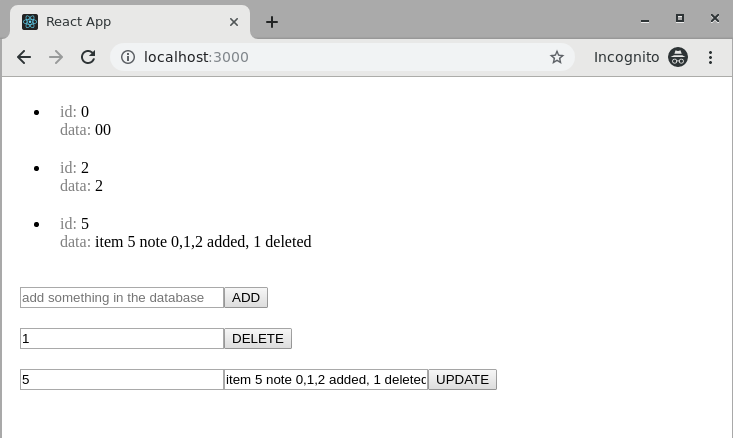

# React example full stack app
# MongoDB, React, Node and Express (MERN)

Original source from [Let’s build a full stack MongoDB, React, Node and Express (MERN) app](https://medium.com/javascript-in-plain-english/full-stack-mongodb-react-node-js-express-js-in-one-simple-app-6cc8ed6de274) and associated github.

Errors fixed, packages upgraded, vulnerabilities corrected, amended with Docker use.

*TODO : use Docker Compose and NginX to proxy ports.*

## Requirements
[Install Docker Engine](https://docs.docker.com/install/).

[Install Docker Compose](https://github.com/docker/compose/releases/latest).

[Install git](https://git-scm.com/book/en/v2/Getting-Started-Installing-Git).


## Build
Please note this is example development build.

```bash
git clone https://github.com/spital/mern-mongo-express-react-nodejs-example
cd mern-mongo-express-react-nodejs-example
docker build -t ern-crud .
```

## Run

```bash
docker run -d -p 27017:27017  mongo:4-bionic
sleep 5
export REACT_APP_MONGO_IP=192.168.1.62
export REACT_APP_MONGO_PORT=27017
export REACT_APP_API_IP=localhost
export REACT_APP_API_PORT=3001
docker run -d -e REACT_APP_MONGO_IP -e REACT_APP_MONGO_PORT -e REACT_APP_API_IP -e REACT_APP_API_PORT -p3000:3000 -p3001:3001 ern-crud
```

## Use
Start web browser and go to (http://localhost:3000/).

The result shall be something like this :


